# 操作系统课程设计：FAT32 文件系统
李浩哲 1712898

---
### 项目介绍
项目实现FAT32文件系统，编写程序读取FAT32文件内容。并且实现下列命令：
- open：打开一个FAT32镜像文件
- close：关闭一个FAT32镜像文件
- info：获取文件系统镜像的信息
- label：获取文件系统镜像的标签
- ls：列出目录下的文件
- ls -l：列出目录下的文件的详细信息
- cat：输出文件内容
- cd：改变当前目录
- pwd：展示当前目录全路径
- file：输出目标文件类型
- stat：展示文件和文件系统的状态信息
- help：获取帮助信息

### 运行环境
- 编译环境：Ubuntu 18.04 LTS
- 编译工具：gcc 7.5.0
- 测试环境：Ubuntu 18.04 LTS
- 运行环境：Cross Platform

### 测试演示
1. 打开`FAT32d.img`文件镜像
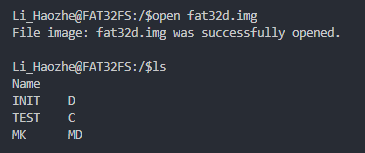
2. 读取文件系统镜像信息
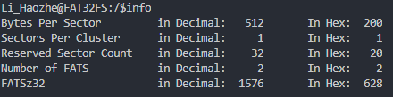
3. 获取文件系统镜像的标签
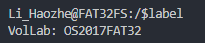
4. 列出目录下文件
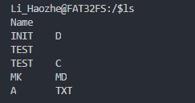
5. 列出目录下文件详细信息
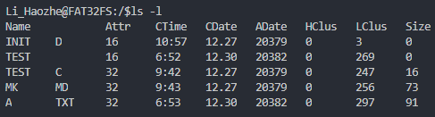
6. 输出文件内容
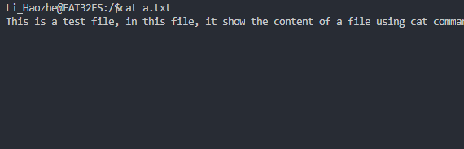
7. 改变当前目录
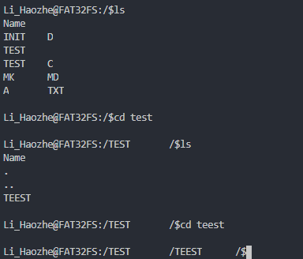
8. 展示当前目录路径
    首先新建多个文件夹如下
    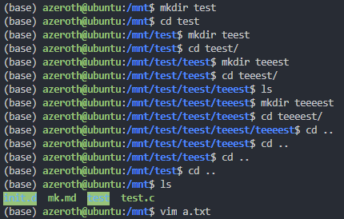
    然后进入`/test/teest/teeest/teeeest/`
    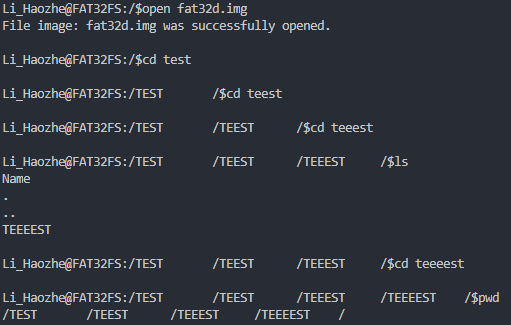
9. 展示目标文件类型
    对于不同文件类型（文件/文件夹），如果目标文件是文件，则返回32，如果目标文件是文件夹，则返回16
    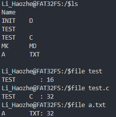
10. 展示文件和文件系统的状态信息
    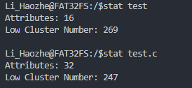
11. 输出帮助信息
    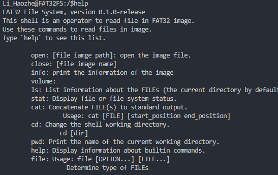

### 实现方式
#### FAT32 文件系统分析
首先读取FAT32文件系统：
- bps = `0x0b-0x0c` 每扇区字节数
- spc = `0x0d`：每簇扇区数
- rsc = `0x0e-0x0f`：保留扇区数
- numFATS = `0x10`：FAT个数
- FATSz32 = `0x24-0x27`：每个FAT占用扇区数

然后可以计算得出数据段开始字节为`(numFATS * FATSz32 * bps) + (rsc * bps)`

然后逐个读取根目录文件信息，保存到结构体中，包括：
- 文件名、扩展名、文件属性、文件创建时间、文件创建日期、文件最后访问日期、文件起始簇号高16位、文件最后修改时间、文件最后修改日期、文件起始簇号低16位、文件长度。

#### 读取文件内容：
从文件的起始簇号低16位开始，记录当前簇是文件记录的第几个簇，然后按顺序递归找到对应簇，读出簇中内容并输出到标准输出。

### 最后
通过这次实验，了解了FAT32文件系统的文件信息存储方式，但是没能实现FAT32文件系统的写入操作，所以文件仅能通过外部挂载在操作系统写入，然后读取，是为不足之处。

##### 最最后赋诗一首

> 操琴共挹清和气
> 作赋锵锵玉屑篇
> 系尽文章成底事
> 统将勲业答新年
